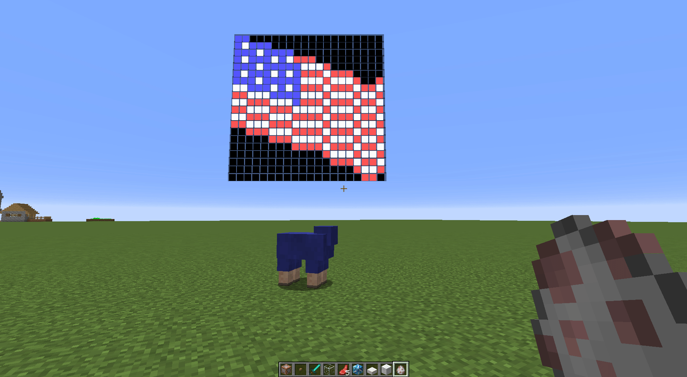

## Description
MultiLineAPI is an easy to use API that allows the server to display infinite lines of text under the nametag for each player, and allows an entity's nametag to be changed (without the limitations of other methods - see below for more information).

#### MultiLineAPI vs Scoreboards and other alternatives

|                               | MultiLineAPI        | Vanilla Scoreboard | TagAPI             | NickNamer          |
|-------------------------------|---------------------|--------------------|--------------------|--------------------|
| Nametag support               | <span style="color: green;">✔</span>                  | <span style="color: red;">✘</span>                  | <span style="color: green;">✔</span>                 | <span style="color: green;">✔</span>                 |
| Character limit (name / line) | <span style="color: green;">(∞ / ∞)</span>             | <span style="color: red;">(✘ / 16)</span>            | (16 / ✘)          | (16 / ✘)          |
| Included API                  | <span style="color: green;">✔</span>                  | <span style="color: green;">✔</span>                  | <span style="color: green;">✔</span>                 | <span style="color: green;">✔</span>                 |
| Minecraft version             | <span style="color: green;">1.8+</span>                | <span style="color: green;">1.6+</span>               | <span style="color: red;">1.7 and below.</span>     | 1.7 - 1.12        |
| Per-player lines and nametag  | <span style="color: green;">✔</span>                  | <span style="color: red;">✘</span>                  | ✔ (name only)      | ✔ (name only)    |
| Commands                      | ✘                  | ✔                  | ✘                 | ✔                 |
| Software Requirements         | Plugin, PacketEntityAPI, & ProtocolLib | ✘                  | Plugin           | Plugin & PacketListenerAPI |

## Compatibility and Dependencies
MultiLineAPI currently requires PacketEntityAPI, which requires ProtocolLib. PacketEntityAPI is used to provide viewer-dependant lines and the more efficient fake entities used by this library. This provides an advantage in stability because even if there is an issue where tags become separated from their targets, they will be reset upon re-login without any changes to the actual world. Furthermore, the mount-based renderer uses a few entities that, because of PacketEntityAPI, do not have to be ticked server-side.


There are no known incompatibilities; however, no guarantees that this plugin will work with packet-modifying plugins such as ViaVersion or ProtocolSupport.

## Commands & Permissions
MultiLineAPI currently does not have any commands or permissions.

## Configuration
MultiLineAPI has a very light configuration, which is used to let you select the proper renderers and configure the line spacings. Here it is:
```yml
#MUST be 'MOUNT' or 'TELEPORT'
defaultRenderer: "MOUNT"

#Here are the options for each renderer
options:
    lineHeight: 0.28
    bottomLineHeight: 0.12
    teleport:
        animated: true

#Here you can define overrides for specific entity types to use one or the other. The key must be the name of the entity
#type, found here: https://hub.spigotmc.org/javadocs/spigot/org/bukkit/entity/EntityType.html
typeRenderers:
    ARROW: "TELEPORT"
    DRAGON_FIREBALL: "TELEPORT"
    ENDER_PEARL: "TELEPORT"
    ENDER_SIGNAL: "TELEPORT"
    UNKNOWN: "MOUNT"
```

There are a few differences between the two renderers (the mount-based renderer or the teleport-based renderer). Here is a comparison table:

<table class="tg">
  <tr>
    <th colspan="2"><h5>Mount-Based Renderer</h5></th>
    <th colspan="2"><h5>Teleport-Based Renderer</h5></th>
  </tr>
  <tr>
    <td style="background: #7aff7a; color: green;"><h6>Pros</h6></td>
    <td style="background: #ff7979; color: red"><h6>Cons</h6></td>
    <td style="background: #7aff7a; color: green"><h6>Pros</h6></td>
    <td style="background: #ff7979; color: red"><h6>Cons</h6></td>
  </tr>
  <tr>
    <td style="background: #ddffdd; color: green;">
        <li> Tag follows entity movements exactly - including client-side assumptions
        <li> Smooth animations when lines are added and removed
        <li> Far fewer packets dispatched
        <li> More stable
    </td>
    <td style="background: #ffdddd; color: red;">
        <li> Uses at least 2 entities to customize the display name, with an additional 6 for each line
        <li> Large amounts of lines can quickly become laggy for clients
        <li> Collision boxes of spacing entities cause tags to become bouncy (this may be fixed in the future)
        <li> Projectiles will collide with their passengers during flight; however, the path of the projectile is not altered because the collision is client-side
    </td>
    <td style="background: #ddffdd; color: green;">
        <li> Fewer entities are used - just 2 entities for the name customization and 1 entity for each line
        <li> Large amounts of lines are more manageable
        <li> Projectiles cannot collide with the lines
        <li> Spacing between lines can be customized
    </td>
    <td style="background: #ffdddd; color: red;">
        <li> Sends far more packets - any move packet for an entity with a customized tag has to be cloned for its nametag and each additional line
        <li> Tags can sometimes lag behind the movement of the entities - especially on things where the client makes assumptions (entities being pushed by pistons, projectiles)
    </td>
  </tr>
</table>

## Known Limitations
With the teleportation-based renderer, sometimes the entities may become separated from their targets. If this happens, please re-log and create an issue with steps to reproduce it so MLAPI can be improved.

## API Usage
MultiLineAPI is designed as an API. It is not meant to be used as a plugin on its own. As such, it will not do anything unless another plugin has been installed that depends upon it. API documentation is available [here](https://iso2013.net/MultiLineAPI/javadocs/).

## Frequently Asked Questions:

#### Q: Does MultiLineAPI support entities?
Yes!

#### Q: Is there a limit on how many lines a tag can have?
Nope. However, I would suggest that you keep it to a maximum of four as a rule of thumb.

But here's a GIF from testing:



#### Q: How is the order of added lines determined?
Registered tag controllers provide a priority for their name changes and their added lines. Higher priority lines are shown above lower priority lines.

Note to developers: You should allow users to configure the priority.

## Images
Coming soon!

## Issues
You may report issues [here](https://github.com/iso2013/MultiLineAPI/issues). Please include the following information, otherwise your report will be ignored:
* Steps to reproduce
* Expected behaviour
* Actual outcome
* Minecraft version (Only 1.12 is officially supported)

## Source Code
Source code is available [here](https://github.com/iso2013/MultiLineAPI)!

## Donations
Want to donate to continue MultiLineAPI's development? I accept donations here:

<center>
    <a href="https://www.paypal.com/cgi-bin/webscr?cmd=_donations&business=blitzcubeowner%40gmail%2ecom&lc=US&item_name=iso2013&item_number=MultiLineAPI&currency_code=USD&bn=PP%2dDonationsBF%3abtn_donateCC_LG%2egif%3aNonHosted">
        
    </a>
</center>
