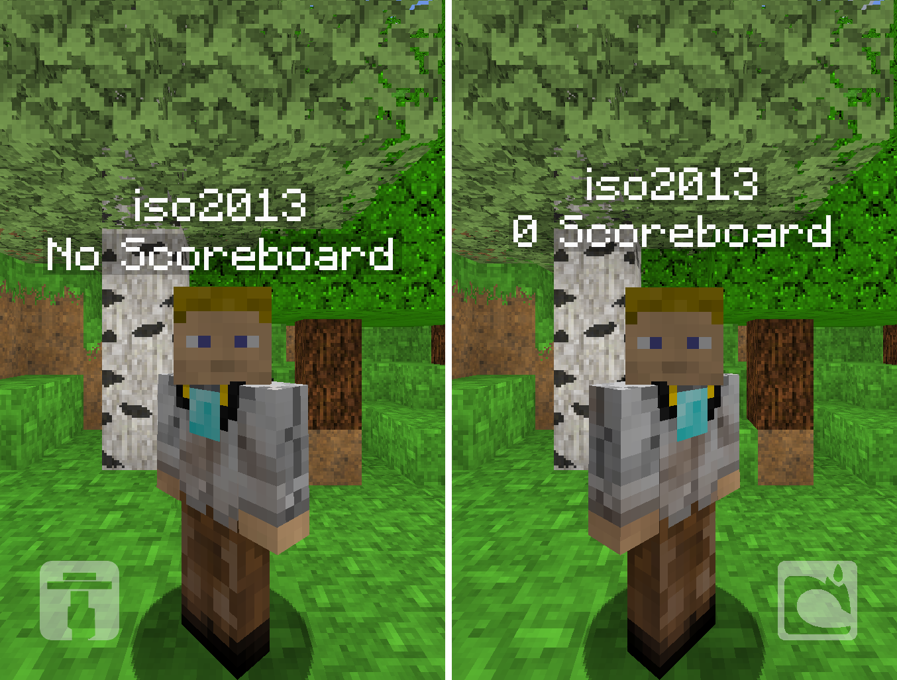

## Description
MultiLineAPI is an easy to use API that allows the server to display a unique second line of text for each player, and allows the player's nametag to be changed (without the limitations of other methods - see below for more information).

#### MultiLineAPI vs Scoreboards and other alternatives

|                               | MultiLineAPI        | Vanilla Scoreboard | TagAPI             | NickNamer          |
|-------------------------------|---------------------|--------------------|--------------------|--------------------|
| Nametag support               | ✔                    | ✘                  | ✔        | ✔                 |
| Infinite Line support           | ✔                    | ✔                  | ✘        | ✘                 |
| Character limit (name / line) | (∞ / ∞)              | (✘ / ∞)            | (16 / ✘) | (16 / ✘)          |
| Included API                  | ✔                    | ✔                  | ✔        | ✔                 |
| Minecraft version             | 1.8+                 | 1.6+               | 1.7 and below.     | 1.7 - 1.10        |
| Commands                      | ✔                    | ✔                  | ✘        | ✔                 |
| Software Requirements         | Plugin & ProtocolLib | ✘                  | Plugin   | PacketListenerAPI |

## Compatibility and Dependencies
MultiLineAPI currently requires ProtocolLib. This is because of a Minecraft server limitation - Players (or any entity) who have passengers are unable to teleport. For this reason, ProtocolLib is used to send the mount packets to the client manually, so the player appears to have the entities mounted on their head but is still able to teleport. ProtocolLib is also used to send packets which prevent a player from seeing their own tags.

## Commands
MultiLineAPI does not have any commands.

## Permissions
Only one permission exists: `secondlineapi.test`, which controls access to the commands listed above. By default, opped players are the only ones with this permission.

## Known Limitations
Sometimes the entities can become separated from the player. If this happens, they will appear to follow the player around at Y=-10. If this happens, please report it and include steps to reproduce using the issue tracker below.

## API Usage
MultiLineAPI is designed as an API. It is not meant to be used as a plugin on its own. API documentation is available [here](https://bitbucket.org/iso2013/secondlineapi/wiki/API).

## Screenshots
Screenshots coming soon! Here's a comparison between MultiLineAPI and the vanilla scoreboard:

## Issues
You may report issues [here](https://bitbucket.org/iso2013/secondlineapi/issues/new). Please include the following information, otherwise your report will be ignored:
* Steps to reproduce
* Expected behaviour
* Actual outcome
* Minecraft version (Only 1.10 and 1.11 are officially supported)

## Source Code
Source code is currently unavailable, but once the API becomes more stable it will be available (ETA: 1 week)
